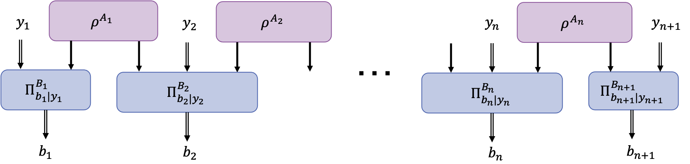

n-Local Chain Inequality
========================

.. currentmodule:: qnetvo

The :math:`n`-local chain network consists of :math:`n` entanglement sources (static preparation node) and :math:`n+1` measurement nodes linked as a chain by the entanglement sources.

   :math:`n` **-Local Chain Network.** 

If the entanglement sources are compared directly to classical shared randomness, then polynomial
Bell inequalities can be derivied that tightly bound the set of classical correlations
[Branciard2012]_, [Mukherjee2015]_.
These :math:`n` -local Bell inequalities can witness quantum violations to the classical :math:`n` 
-local set.
The variations of these inequalities and their quantum violations are discussed further as they are
integrated into cost functions.

.. autofunction:: nlocal_chain_cost_22

.. autofunction:: I22_fn

.. autofunction:: J22_fn

.. autofunction:: parallel_nlocal_chain_grad_fn

References
----------

.. [Branciard2012] Branciard, Cyril, et al. "Bilocal versus nonbilocal correlations in
   entanglement-swapping experiments." Physical Review A 85.3 (2012): 032119.

.. [Mukherjee2015] Mukherjee, Kaushiki, Biswajit Paul, and Debasis Sarkar. "Correlations in :math:`n`
    -local scenario." Quantum Information Processing 14.6 (2015): 2025-2042.